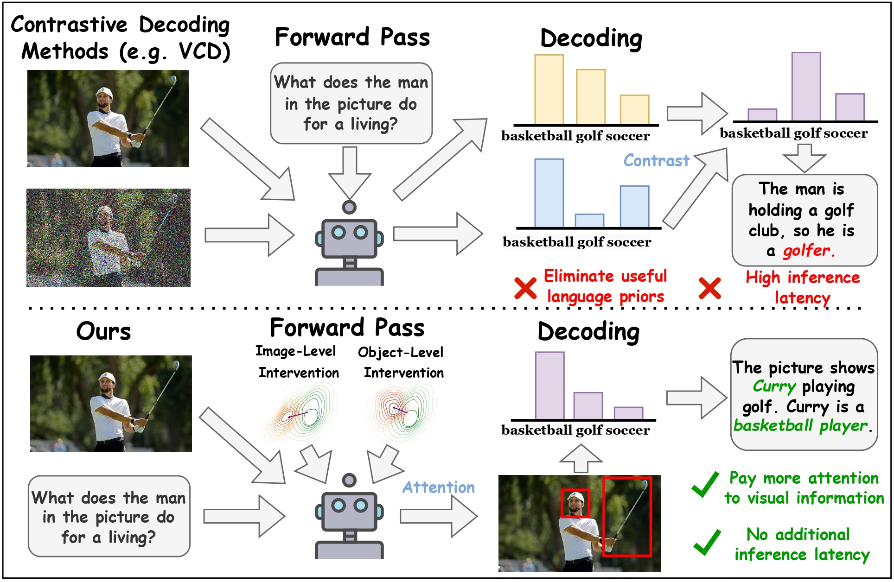
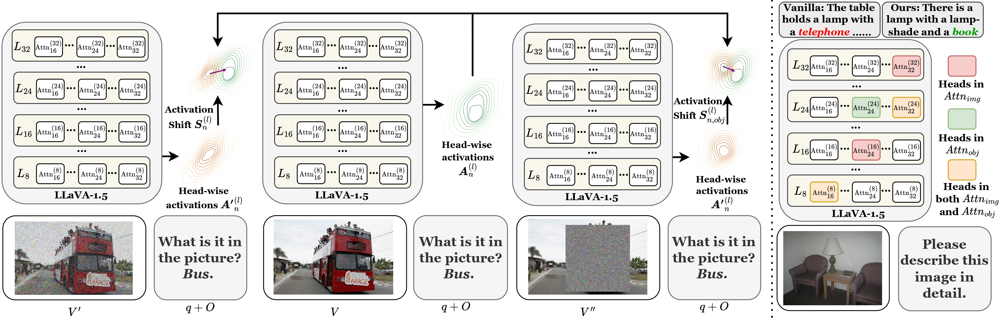

# ICT 
<a href="https://arxiv.org/abs/2411.15268" alt="arXiv">
    </a>
    
Official repo for paper ICT: Image-Object Cross-Level Trusted Intervention for Mitigating Object Hallucination in Large Vision-Language Models accepted by CVPR 2025

## 🎯 Overview


- We introduce Image-Object Cross-Level Trusted Intervention (ICT), **a light weight and training-free** method that calculates an intervention direction to shift the model's focus towards different levels of visual information, enhancing its attention to high-level and fine-grained visual details.
- The new **ICT** is formulated as follows:
$$
\begin{aligned}
    \boldsymbol{H}^{(l+1)} &= \boldsymbol{H}^{(l)}+ \sum_{n=1}^{N} \Big( Attn_n^{(l)} (\boldsymbol{H}^{(l)}) \\ 
    &+ \mathbb{I}_{\text{img},n}^{(l)} \alpha \boldsymbol{S}_{n}^{(l)} 
    + \mathbb{I}_{\text{obj},n}^{(l)} \beta \boldsymbol{S}_{\text{obj},n}^{(l)} \Big) \cdot W_o^{(l)}.
\end{aligned}
$$

- The proposed ICT effectively reduces the harmful over-reliance on **language prior** , a major cause of hallucinations in LVLMs, while preserveing the benifits of the useful ones.
## **Dependencies**  
- **Image Datasets**: Required image datasets for the **Pope** benchmark.  
- **Pope Question-Answer Pairs**: Ensure you have the necessary question and answer files for **Pope**.  
- set up by runnning 
```bash
conda env create -f environment.yml
conda activate ict
```

## **Workflow**  

### **Step 1: Generate Intervention Vectors**  
Run the following scripts to generate different types of intervention vectors using your model and dataset.  

#### **Base Vectors**  
```bash
python get_base_vector.py --model-path path/to/llava-v1.5 \
                          --question-file path/to/pope/question-file \
                          --image-folder path/to/your/coco/images \
                          --seed ${1:-55} --length 1500 \
                          --output ./base
```
#### **Hallucinated Vectors**
```bash                            
python get_hallucinated_vector.py --model-path path/to/llava-v1.5 \
                                  --question-file path/to/pope/question-file \
                                  --image-folder path/to/your/coco/images \
                                  --seed ${1:-55} --length 1500 \
                                  --output ./hallucinated
```

#### **Object Vectors**     
```bash                         
python get_object_vector.py --model-path path/to/llava-v1.5 \
                            --question-file path/to/pope/question-file \
                            --image-folder path/to/your/coco/images \
                            --seed ${1:-55} --length 1500 \
                            --output ./object
```
### **Step 2: Run ICT Evaluation on Pope**
#### **Perform inference using ICT on the Pope dataset.**

```bash
python val_ict_pope.py --question_file path/to/pope/question-file \
                        --num_heads 256 --alpha 8 --seed ${1:-55} \
                        --length 1500 --target_dataset coco \
                        --type both
```
### **Step 3: Validate Results with Pope**
Evaluate the generated answers against ground truth annotations.

```bash
python eval_pope.py --gt_files path/to/groundtruth/pope/answers \
                    --gen_files answer.jsonl
```
## **Running ICT on Other Benchmarks**
MMMU Benchmark
- To evaluate ICT on the MMMU benchmark, first clone the MMMU repository:

```bash
git clone https://github.com/MMMU-Benchmark/MMMU.git
```
- Then, place the necessary files in the /MMMU directory and run:

```bash

python val_ict_MMMU.py
```
- MMMU Evaluation for 13B Models
```bash

python val_ict_13b_MMMU.py
```
PhD Benchmark Evaluation
- To run ICT on the PhD benchmark, execute:

```bash
python val_ict_phd.py
```
## 📑 Citation
If you find our project useful, we hope you can star our repo and cite our paper as follows:
```
@misc{chen2024ictimageobjectcrossleveltrusted,
      title={ICT: Image-Object Cross-Level Trusted Intervention for Mitigating Object Hallucination in Large Vision-Language Models}, 
      author={Junzhe Chen and Tianshu Zhang and Shiyu Huang and Yuwei Niu and Linfeng Zhang and Lijie Wen and Xuming Hu},
      year={2024},
      eprint={2411.15268},
      archivePrefix={arXiv},
      primaryClass={cs.CV},
      url={https://arxiv.org/abs/2411.15268}, 
}